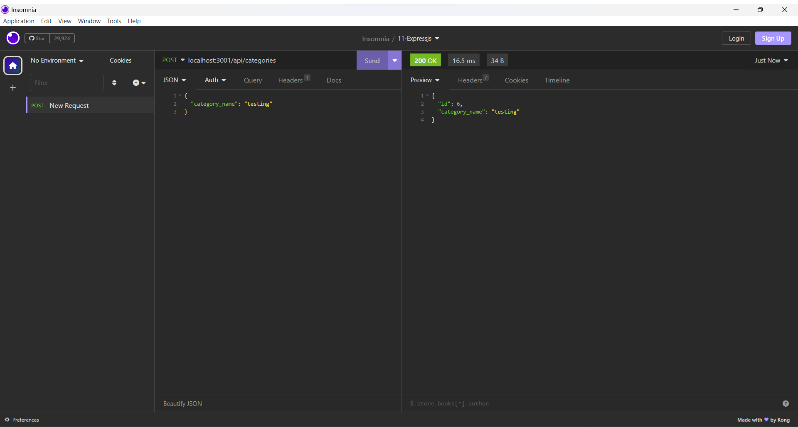

# E-Commerce Back End Application
  

  ### Table of Content
  * [Description](#description)
  * [Installation](#installation)
  * [Usage](#usage)
  * [Contributing](#contributing)
  * [Developer Information](#developer-information)
  * [License](#license)

  ### Description:
  The project is an assignment of a coding bootcamp program, with the purpose for students learn how to use MySQL, Sequelize, Dotenv, Insomnia and Object-Relational Mapping. The application is the back end for a retail company e-commerce website that uses the latest technologies. The products are sorted in categories and tags and stored in a MySQL database. This application allows the retail company managers to view, add, replace and delete items from their inventory.

  ### Installation:
  - Clone the initial code git repository.
  - Install NodeJS and MySQL to the machine if not already installed.
  - Navigate on the terminal to the directory ecommerce-backend where the code was cloned to.
  - Type "npm i", "mysql -u root -p", "source ./db/schema.sql", "exit", "npm run seed" and "node server.js".

  ### Usage:
  [Click here](https://drive.google.com/file/d/1SziOteutDfpBEBJGke5inlRudJNPsTX-/view) to watch a demo on how to use the application. 
  - Open Insomnia
  - Select "GET", then type and send "localhost:3001/api/categories" to see all the categories, "localhost:3001/api/products" to see all the products, and "localhost:3001/api/tags" to see all the tags. 
  
  - Type and send "localhost:3001/api/categories/i" to see a specific category with id [i], "localhost:3001/api/products/i" to see a specific product with id [i], and "localhost:3001/api/tags/i" to see a specific tag with id [i].
  
  - Select "POST", then type the "localhost:3001/api/categories" route and {"category_name": "XX"} as content, XX being a place holder for the name of a new category you'd like to add, and send it.
  
  - Select "PUT", then type the "localhost:3001/api/categories/i" route and {"category_name": "YY"} as content, YY being a place holder for the name of a new category name that you'd like to replace the category with id [i] for, and send it.
  
  - Select "DELETE", then type the "localhost:3001/api/categories/i" route to delete a category with id [i].
  

  ### Contributing
  I have received advice from the UC Berkeley Extension tutor Matthew Calimbas on debugging and testing my code. I also reached out to the [Mozilla Developer](https://developer.mozilla.org/en-US/) webpage and [NPM Docs](https://docs.npmjs.com/) for documentation.

  ### Developer Information:
  - Virginia Freitas
  - GitHub URL: https://github.com/virginiafreitas
  - e-mail address: virginiacdefreitas@gmail.com

  ### License:
  The application is covered under the MIT license.
  
